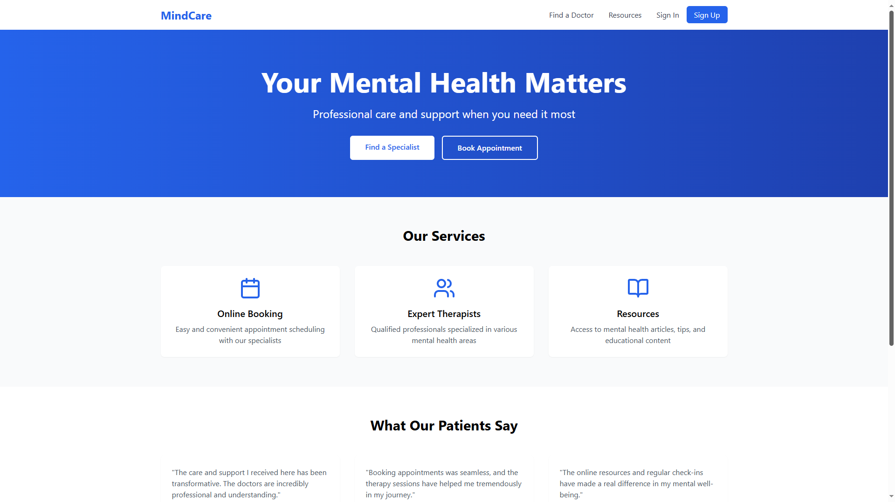
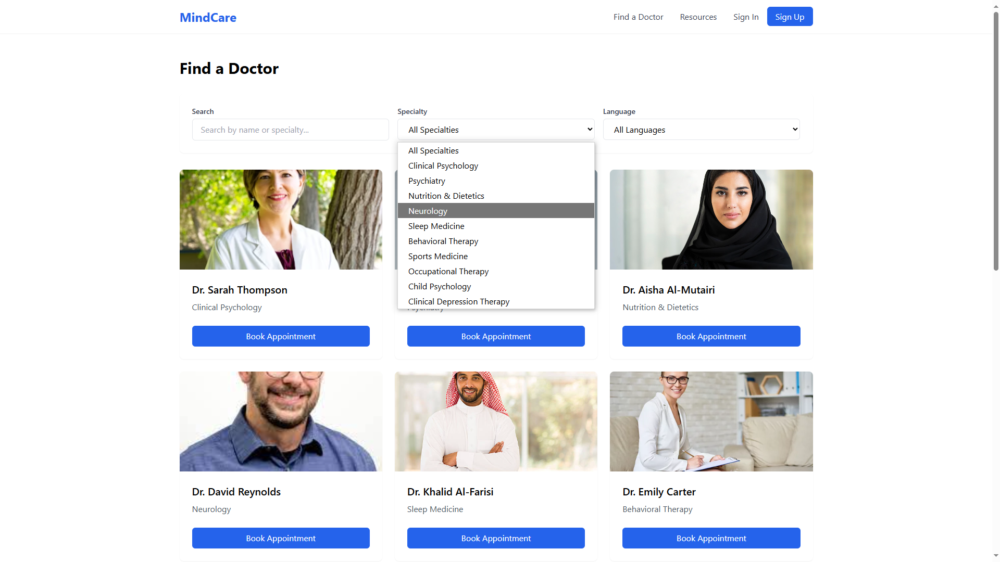

<h1 align="center">🧠 Mindhaven</h1>

<p align="center">
Mental Wellness Platform | Built with React + Tailwind CSS + Firebase
</p>

---
## 🖼 Screenshots

### 🏠 Homepage


---

### 🧾 Booking Page



## 🌐 Live Site

[🔗 Visit Mindhaven](https://legendary-daffodil-6b12b9.netlify.app/)

---

## 💡 About the Project

Mindhaven is a modern mental health clinic platform offering a calming and intuitive user experience for patients seeking online therapy and support.

Features include:
- 🩺 Appointment booking with specialists
- 🧘 Wellness tracking & resources
- 📰 Blog posts and testimonials
- 🔐 Firebase authentication
- 🎯 Responsive design using Tailwind CSS

---

## 🛠️ Tech Stack

- **Frontend:** React, Tailwind CSS, Vite
- **Backend:** Firebase (Authentication, Firestore)
- **Tools:** Git, GitHub, Netlify

---

## 📷 Screenshots

> *(Add your screenshots here if needed — just drag them into the README or host them and link like this)*

---

## 🚀 Setup & Run Locally

```bash
git clone https://github.com/lRashaf/Mindhaven.git
cd Mindhaven
npm install
npm run dev
